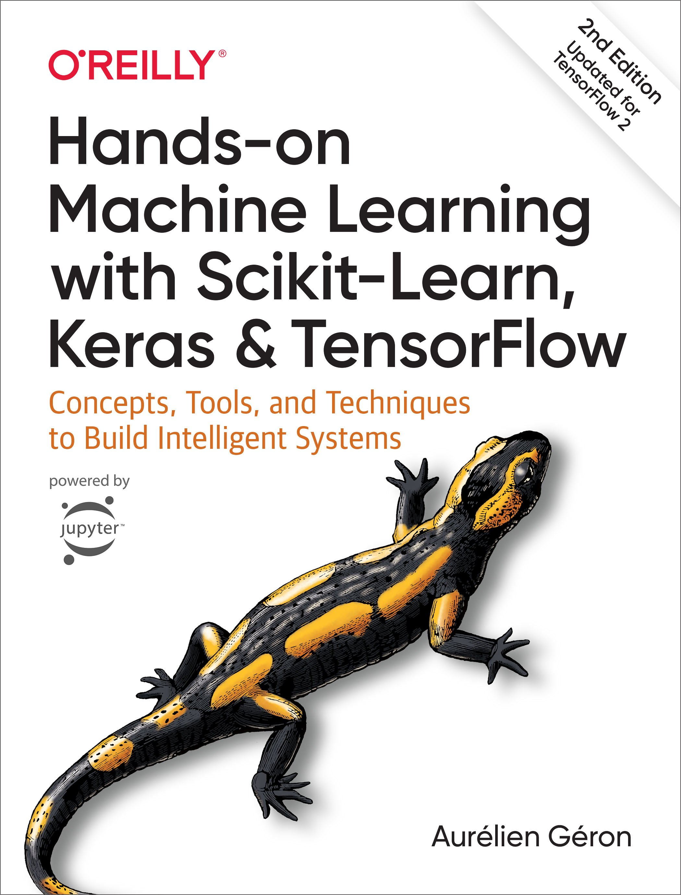

# **Some useful resources**

<table>
    <tr>
        <td>
            
            The updated edition of this best-selling book uses concrete examples, minimal theory, and two production-ready Python frameworks--Scikit-Learn and TensorFlow 2--to help you gain an intuitive understanding of the concepts and tools for building intelligent systems. Practitioners will learn a range of techniques that they can quickly put to use on the job. Part 1 employs Scikit-Learn to introduce fundamental machine learning tasks, such as simple linear regression. Part 2, which has been significantly updated, employs Keras and TensorFlow 2 to guide the reader through more advanced machine learning methods using deep neural networks. With exercises in each chapter to help you apply what you've learned, all you need is programming experience to get started.
        </td>
        <td>
            
            Deep learning has already achieved remarkable results in many fields. Now it’s making waves throughout the sciences broadly and the life sciences in particular. This practical book teaches developers and scientists how to use deep learning for genomics, chemistry, biophysics, microscopy, medical analysis, and other fields.
        </td>
    </tr>
</table>