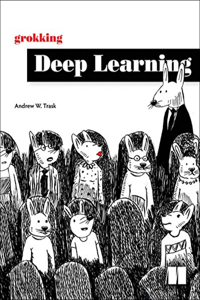

## **Hands-On Machine Learning with Scikit-Learn, Keras, and TensorFlow**
## Concepts, Tools, and Techniques to Build Intelligent Systems

The updated edition of this best-selling book uses concrete examples, minimal theory, and two production-ready Python frameworks--Scikit-Learn and TensorFlow 2--to help you gain an intuitive understanding of the concepts and tools for building intelligent systems. Practitioners will learn a range of techniques that they can quickly put to use on the job. Part 1 employs Scikit-Learn to introduce fundamental machine learning tasks, such as simple linear regression. Part 2, which has been significantly updated, employs Keras and TensorFlow 2 to guide the reader through more advanced machine learning methods using deep neural networks. With exercises in each chapter to help you apply what you've learned, all you need is programming experience to get started.

---

## **Deep Learning for the Life Sciences**
## Applying Deep Learning to Genomics, Microscopy, Drug Discovery, and More

Deep learning has already achieved remarkable results in many fields. Now it’s making waves throughout the sciences broadly and the life sciences in particular. This practical book teaches developers and scientists how to use deep learning for genomics, chemistry, biophysics, microscopy, medical analysis, and other fields.

---

## **System Design Interview: An Insider’s Guide**

The objective of this book is to provide a reliable strategy to approach the system design questions. The right strategy and knowledge are vital to the success of an interview.  
This book provides solid knowledge in building a scalable system. The more knowledge gained from reading this book, the better you are equipped in solving the system design
questions.  
This book also provides a step by step framework on how to tackle a system design question. It provides many examples to illustrate the systematic approach with detailed steps that you can follow. With constant practice, you will be well-equipped to tackle system design interview questions.

---

## **Python for Data Analysis**
## Data Wrangling with Pandas, NumPy, and IPython

Python for Data Analysis is concerned with the nuts and bolts of manipulating, processing, cleaning, and crunching data in Python. It is also a practical, modern introduction to scientific computing in Python, tailored for data-intensive applications. This is a book about the parts of the Python language and libraries you’ll need to effectively solve a broad set of data analysis problems. This book is not an exposition on analytical methods using Python as the implementation language.

Written by Wes McKinney, the main author of the pandas library, this hands-on book is packed with practical cases studies. It’s ideal for analysts new to Python and for Python programmers new to scientific computing.

- Use the IPython interactive shell as your primary development environment
- Learn basic and advanced NumPy (Numerical Python) features
- Get started with data analysis tools in the pandas library
- Use high-performance tools to load, clean, transform, merge, and reshape data
- Create scatter plots and static or interactive visualizations with matplotlib
- Apply the pandas groupby facility to slice, dice, and summarize datasets
- Measure data by points in time, whether it’s specific instances, fixed periods, or intervals
- Learn how to solve problems in web analytics, social sciences, finance, and economics, through detailed examples

---

## **Grokking Deep Learning**

Grokking Deep Learning teaches you to build deep learning neural networks from scratch! In his engaging style, seasoned deep learning expert Andrew Trask shows you the science under the hood, so you grok for yourself every detail of training neural networks. Using only Python and its math-supporting library, NumPy, you’ll train your own neural networks to see and understand images, translate text into different languages, and even write like Shakespeare! When you’re done, you’ll be fully prepared to move on to mastering deep learning frameworks.

---

## **Machine Learning with Python Cookbook: Practical Solutions from Preprocessing to Deep Learning**

This book is not an introduction to machine learning. If you are not comfortable with the basic concepts of machine learning or have never spent time learning machine learning, do not buy this book. Instead, this book is for the machine learning practitioner who, while comfortable with the theory and concepts of machine learning, would benefit from a quick reference containing code to solve challenges he runs into working on machine learning on an everyday basis.

This book assumes the reader is comfortable with the Python programming language and package management.

---

## **High Performance Python, 2nd Edition**

Your Python code may run correctly, but you need it to run faster. Updated for Python 3, this expanded edition shows you how to locate performance bottlenecks and significantly speed up your code in high-data-volume programs. By exploring the fundamental theory behind design choices, High Performance Python helps you gain a deeper understanding of Python’s implementation.

How do you take advantage of multicore architectures or clusters? Or build a system that scales up and down without losing reliability? Experienced Python programmers will learn concrete solutions to many issues, along with war stories from companies that use high-performance Python for social media analytics, productionized machine learning, and more.

- Get a better grasp of NumPy, Cython, and profilers
- Learn how Python abstracts the underlying computer architecture
- Use profiling to find bottlenecks in CPU time and memory usage
- Write efficient programs by choosing appropriate data structures
- Speed up matrix and vector computations
- Use tools to compile Python down to machine code
- Manage multiple I/O and computational operations concurrently
- Convert multiprocessing code to run on local or remote clusters
- Deploy code faster using tools like Docker

---

## **Practical Statistics for Data Scientists**
## 50+ Essential Concepts Using R and Python by Peter Bruce, Andrew Bruce, Peter Gedeck

Statistical methods are a key part of data science, yet few data scientists have formal statistical training. Courses and books on basic statistics rarely cover the topic from a data science perspective. The second edition of this popular guide adds comprehensive examples in Python, provides practical guidance on applying statistical methods to data science, tells you how to avoid their misuse, and gives you advice on what’s important and what’s not.

Many data science resources incorporate statistical methods but lack a deeper statistical perspective. If you’re familiar with the R or Python programming languages and have some exposure to statistics, this quick reference bridges the gap in an accessible, readable format.

With this book, you’ll learn:

- Why exploratory data analysis is a key preliminary step in data science
- How random sampling can reduce bias and yield a higher-quality dataset, even with big data
- How the principles of experimental design yield definitive answers to questions
- How to use regression to estimate outcomes and detect anomalies
- Key classification techniques for predicting which categories a record belongs to
- Statistical machine learning methods that "learn" from data
- Unsupervised learning methods for extracting meaning from unlabeled data.

